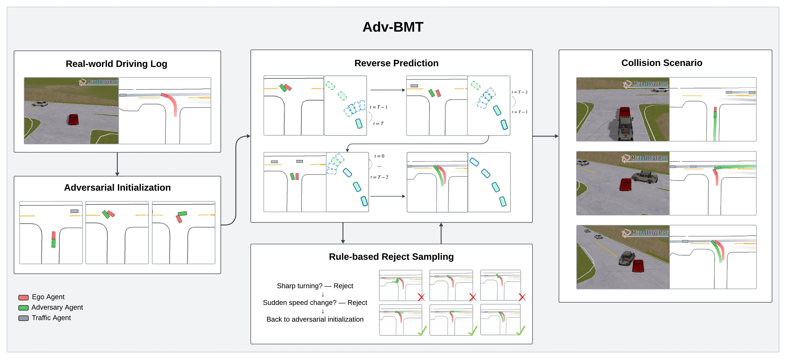

# Adv-BMT: Bidirectional Motion Transformer for Safety-Critical Traffic Scenario Generation (NeurIPS 2025)

<a href="https://arxiv.org/pdf/2506.09485"></a> 
<a href="https://metadriverse.github.io/adv-bmt/"></a>

[Yuxin Liu](https://www.linkedin.com/in/yuxinclaire/)<sup>1*</sup>, [Zhenghao Peng](https://pengzhenghao.github.io)<sup>1*</sup>, [Xuanhao Cui]()<sup>1</sup>, [Bolei Zhou](https://boleizhou.github.io/)<sup>1</sup> <br>
<sup>1</sup>UCLA&emsp;
<sup>*</sup>Equal contribution <br>



## Getting started

## Setup environment

> note: Please refer to [FAQ](#FAQ) section for any issues.


```bash

# Create virtual environment
conda create -n adv-bmt "python=3.10" -y
conda activate adv-bmt


# Install Metadrive
git clone https://github.com/metadriverse/metadrive.git
cd ~/metadrive
pip install -e .
cd ~/

# Install ScenarioNet
git clone https://github.com/metadriverse/scenarionet.git
cd ~/scenarionet
pip install -e .
cd ~/


# Clone the code to local and Install basic dependency for this project
git clone https://github.com/Yuxin45/Adv-BMT.git
pip install -e .

# Install Waymo Open Dataset
pip uninstall -y waymo-open-dataset-tf-2-11-0
pip uninstall -y waymo-open-dataset-tf-2-12-0
pip install waymo-open-dataset-tf-2-12-0==1.6.4

# Verify pytorch, expect True.
python -c "import torch;print(torch.cuda.is_available())"


# (Optional) If your torch is not installed properly.
# That is, torch.cuda.is_available() is False, then:
# Install pytorch by yourself to make them compatible with your GPU: https://pytorch.org/
# Note: First checkout which cuda you have at your 
ls /usr/local
# For cuda 11.7:
pip install torch torchvision torchaudio --index-url https://download.pytorch.org/whl/cu117
# For cuda 11.8:
pip install torch==2.0.1+cu118 torchvision==0.15.2+cu118 torchaudio==2.0.2 --index-url https://download.pytorch.org/whl/cu118
# For cuda 12.1:
conda install pytorch torchvision torchaudio pytorch-cuda=12.1 -c pytorch -c nvidia -y

```

### Running Adv-BMT

#### Gradio demo

We provide a user interface for testing our method. Running the following command starts the demo.
```bash
python bmt/gradio_ui/new_ui.py --share
```


#### Running Adv-BMT

We provide a script for running Adv-BMT.
```bash
bash scripts/ADV-BMT_dataset_generate.sh
```

#### Evaluation
We provide scripts for running scenario evaluations.
```bash
python bmt/eval/evaluate_scenario_metrics.py eval_mode={your_eval_mode}
```

Evaluation argument

There are a required argument for our scenario evaluator:

| eval_mode                                 |meaning |
| ---------------------------------------- | ------------------ | 
| `SCGEN`                          | Adv-BMT generation            | 
| `GPTmodel`                     | BMT with forward prediction              | 
| `Backward`                        | BMT with reverse prediction              | 
| `Backward_Forward` | BMT with bidirectional prediction              |
| `CAT/SEAL/STRIVE` | baseline generated scenario             |


#### RL Experiment
We provide scripts for running open-loop and closed-loop reinforcement learning.
```bash
bash bmt/rl_train/scripts/0511_CLRL_SCGEN.sh
```

## FAQ

Q: `ImportError: cannot import name 'COMMON_SAFE_ASCII_CHARACTERS' from 'charset_normalizer.constant`

A: 
```bash
pip install chardet
```

---

Q: `AttributeError: partially initialized module 'charset_normalizer' has no attribute 'md__mypyc' (most likely due to a circular import)`

A: 
```bash
pip install -U --force-reinstall charset-normalizer
```


---

Q: `RuntimeError: The detected CUDA version (10.1) mismatches the version that was used to compile
PyTorch (11.7). Please make sure to use the same CUDA versions.`

A: Try:
```bash
export CUDA_HOME=/usr/local/cuda-11.7
python setup.py develop
```

---


Q: When compiling MTR's CUDA code (e.g. `python setup.py`) locally: `RuntimeError: The detected CUDA version (11.7) mismatches the version that was used to compile
PyTorch (12.1). Please make sure to use the same CUDA versions.`

A: Try:
```bash
# Download CUDA first: https://developer.nvidia.com/cuda-12-1-0-download-archive

export CUDA_HOME=/usr/local/cuda-12.1
python setup.py develop
```

## Reference

If you use our code in your research, please cite the following work.

```bibtex
@misc{liu2025advbmtbidirectionalmotiontransformer,
      title={Adv-BMT: Bidirectional Motion Transformer for Safety-Critical Traffic Scenario Generation}, 
      author={Yuxin Liu and Zhenghao Peng and Xuanhao Cui and Bolei Zhou},
      year={2025},
      eprint={2506.09485},
      archivePrefix={arXiv},
      primaryClass={cs.RO},
      url={https://arxiv.org/abs/2506.09485}, 
}
```
You can find our paper in the NeurIPS 2025 Proceedings with the full BibTex citation [here](https://neurips.cc/virtual/2025/poster/117225).
